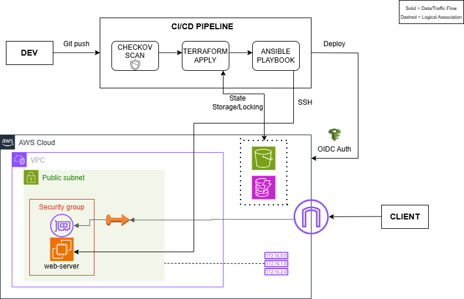

**Automated Infrastructure Lifecycle Management**  
A production-grade CI/CD pipeline that automates the provisioning of cloud infrastructure and the configuration of web services using a security-first approach.

**Project Scope**  
This project focuses on automated cloud infrastructure provisioning and configuration management using Terraform, Ansible, and GitHub Actions on AWS. It implements enterprise-level security via OIDC keyless authentication and ensures state durability through S3/DynamoDB remote backends. High-level orchestration (EKS) and serverless patterns are explored in later iterations.

**Installation & Setup**  
Follow these steps to deploy the automated infrastructure and configure the web server using Terraform, Ansible, and GitHub Actions.  

 1. Prerequisites  
  - AWS Account: An active account with permissions to create EC2, VPC, and IAM resources.  
  - GitHub Account: For hosting the repository and running GitHub Actions.  
  - Terraform & Ansible: (Optional) Installed locally for manual testing and debugging.  
  - SSH Key Pair: A public/private key pair (named solid-key in this project) for secure EC2 access.  

 2. Repository Setup  
  Clone the repository to your local machine:

```bash  
git clone https://github.com/ChukaOkeke/automated-infra-lifecycle.git
cd restaurant-api-k8s  
```

 3. Environment & Secret Configuration  
  This project relies on GitHub Secrets to securely manage cloud access and sensitive credentials.  
  - AWS OIDC Configuration: Ensure you have an IAM Role configured with a Trust Policy for GitHub Actions.  
  - Configure GitHub Secrets: Go to your repository Settings > Secrets and variables > Actions and add the following:  
   -> AWS_ROLE_TO_ASSUME: The ARN of the IAM Role for Terraform to provision resources.  
   -> SSH_PRIVATE_KEY: Your private SSH key (must match the solid-key public key on AWS).  

 4. Deployment  
  The deployment is fully automated via CI/CD.  
  - Trigger the Pipeline: Push your changes to the main or feature/cicd branch:  

```bash  
git add .
git commit -m "feat: deploy automated infrastructure"
git push origin <your-branch-name>  
```

  - Monitor Progress: Open the Actions tab in your GitHub repository to watch the Terraform provisioning and Ansible configuration steps.  
  - Verify the Web Server: Once the "Run Ansible Playbook" step completes successfully, grab the Public IP of your new EC2 instance from the AWS or GitHub Runner Console and visit it in your browser to see the Nginx welcome page.  

**1. Problem & Constraints**  
 **Problem Statement**  
 The goal was to automate the provisioning and configuration of cloud-native resources on AWS, thereby bypassing manual "click-ops".  

 **Key Features & Constraints**  
 - Keyless Cloud Authentication: Secure AWS access via OIDC, eliminating the risk of long-lived IAM credentials.
 - Remote State Management: Guaranteed "Source of Truth" using S3 for state storage and DynamoDB for state locking.
 - Dynamic Infrastructure Discovery: Automated server configuration using Ansible Dynamic Inventory to eliminate hardcoded IP addresses.
 - Infrastructure as Code (IaC): Reproducible environment provisioning via modular Terraform configurations.
 - Continuous Deployment: Full lifecycle automation from code push to server configuration using GitHub Actions.


**2. Architecture Overview**  
The architecture is designed to decouple the deployment engine from the target infrastructure, ensuring a secure and scalable lifecycle.  

 **System Architecture Diagram**  

   


 **Component responsibilities**  
 - CI/CD Block: GitHub Actions executes a three-phase workflow: Checkov Scan (Security Audit) $\rightarrow$ Terraform Apply (Provisioning) $\rightarrow$ Ansible Playbook (Configuration).
 - Global Services: S3 and DynamoDB reside outside the VPC to manage Terraform state and concurrency locks.
 - VPC Boundary: A hardened private network containing the EC2 instance, protected by specific Security Group rules and accessible only via the authorized pipeline.


 **Trust boundaries**  
 **TB1: GitHub Actions -> AWS (OIDC Federation)**: Keyless, session-based tokens replace static credentials, scoped to specific repository branches.  

 **TB2: Terraform -> Remote State (Encryption & Locking)**: State metadata is encrypted at rest in S3 and protected from concurrent modification via DynamoDB.  

 **TB3: Pipeline -> EC2 (SSH Key Management)**: Private keys are injected ephemerally into runner memory and never persist in the codebase.  

 **TB4: Ansible -> Infrastructure (Dynamic Discovery)**: Targets are identified via strict AWS tag-filtering (*tag:Name: web-server*) rather than static IPs.  


**3. Key Design Decisions & Trade-offs**  
 - **Selected Terraform over Manual Config**: Ensures the environment is versioned and reproducible.
 - **Implemented OIDC**: Hardened security posture by removing the need for long-lived IAM keys.
 - **Utilized Ansible Dynamic Inventory**: Increased system resilience by "discovering" infrastructure metadata at runtime.
 - **Integrated Checkov IaC scan**: Integrated SAST to identify and prevent infra misconfigurations.


**4. Implementation**  
 I used Terraform to architect and provision the AWS infrastructure (VPC, Subnets, and EC2) as code. Used GitHub Actions as the CI/CD engine to automate the lifecycle, utilizing OIDC for secure, keyless authentication to AWS. Used Ansible with a Dynamic Inventory (*aws_ec2* plugin) to automatically discover the provisioned instances and perform post-deployment configuration, including the installation and optimization of Nginx.


**5. Quality Assurance & Testing**  
 - Infrastructure Validation: Monitored GitHub Actions logs to verify Terraform resource creation and state consistency.
 - Service Verification: Confirmed Nginx availability by accessing the EC2 Public IP to verify the live landing page.


**6. Security**  
 - **OIDC Identity Federation**: Used OIDC for short-lived session tokens.
 - **Secrets Isolation**: GitHub Secrets handled the ephemeral injection of SSH private keys.
 - **Network Hardening**: Restricted Security Group rules to essential ports (80/22).
 - **Static Analysis (SAST)**: Performed automated security scans using Checkov to identify misconfigurations.

**Tech Stack**  
 - Cloud - **AWS**
 - Infrastructure as Code: **Terraform / Ansible** 
 - CI/CD: **GitHub Actions**
 - Security: **Checkov**


**Deep Dive & Demo**  
This repository focuses on automated infrastructure provisioning and configuration management on AWS using Terraform, Ansible, and GitHub Actions. A detailed breakdown of the architectural decisions, design trade-offs, security boundaries, and lessons learned during the project is documented here on [Automating Infrastructure Lifecycle Management](https://medium.com/@chukaokeke/automating-infrastructure-lifecycle-management-3e137b6be298).  
A demo can be found here on [Automated Infra Lifecyle demo](https://youtu.be/aSsMEv1PSSg?si=K_0ucsHdsSlyKOnu).